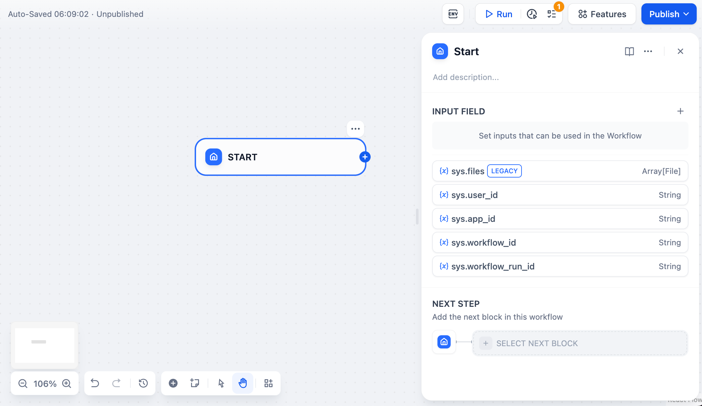
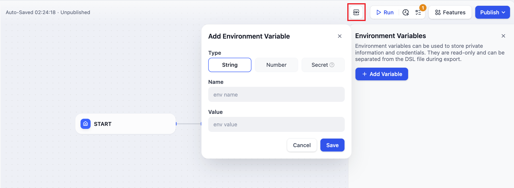
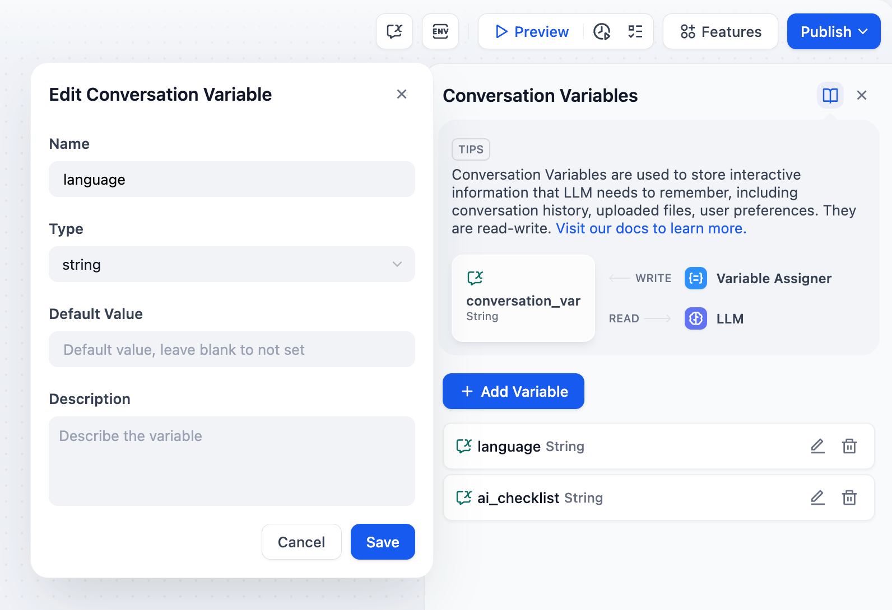

# متغیرها

**برنامه‌های گردش کار** و **چت‌فلو** از گره‌های مستقل تشکیل شده‌اند. اکثر گره‌ها دارای ورودی و خروجی هستند، اما اطلاعات ورودی و خروجی هر گره ثابت نیست و پویا است.

**چگونه از یک نماد ثابت برای اشاره به محتوای پویا در حال تغییر استفاده کنیم؟** متغیرها، به عنوان ظروف داده پویا، می‌توانند محتوای ثابت نشده را ذخیره و منتقل کنند، به طور متقابل در گره‌های مختلف به آنها ارجاع داده شوند و انعطاف‌پذیری تحرک اطلاعات را بین گره‌ها فراهم کنند.

### متغیرهای سیستمی

متغیرهای سیستمی به پارامترهای از پیش تعیین شده در سطح سیستم در برنامه Chatflow / Workflow App اشاره دارند که می‌توانند به طور جهانی توسط سایر گره‌ها خوانده شوند. تمام متغیرهای سطح سیستم با `sys.` شروع می‌شوند.

#### گردش کار

برنامه‌های نوع گردش کار متغیرهای سیستمی زیر را ارائه می‌دهند:

<table><thead><tr><th>نام متغیر</th><th>نوع داده</th><th width="267">توضیحات</th><th>نکته</th></tr></thead><tbody><tr><td>
<code>sys.files</code>

<code>[LEGACY]</code>
</td><td>Array[File]</td><td>پارامتر فایل: تصاویر آپلود شده توسط کاربران را ذخیره می‌کند</td><td>برای فعال کردن عملکرد آپلود تصویر، باید ویژگی "ویژگی‌ها" را در گوشه سمت راست بالای صفحه تنظیم برنامه فعال کنید.</td></tr><tr><td><code>sys.user_id</code></td><td>String</td><td>شناسه کاربری: یک شناسه منحصر به فرد که توسط سیستم به طور خودکار به هر کاربر هنگام استفاده از برنامه گردش کار اختصاص داده می‌شود. برای تشخیص کاربران مختلف استفاده می‌شود</td><td></td></tr><tr><td><code>sys.app_id</code></td><td>String</td><td>شناسه برنامه: یک شناسه منحصر به فرد که توسط سیستم به طور خودکار به هر برنامه اختصاص داده می‌شود. این پارامتر برای ضبط اطلاعات اولیه برنامه فعلی استفاده می‌شود. </td><td>این پارامتر برای تمایز و یافتن برنامه‌های گردش کار مجزا برای کاربران با قابلیت‌های توسعه استفاده می‌شود.</td></tr><tr><td><code>sys.workflow_id</code></td><td>String</td><td>شناسه گردش کار: این پارامتر اطلاعات مربوط به تمام اطلاعات گره در برنامه گردش کار فعلی را ثبت می‌کند.</td><td>این پارامتر می‌تواند توسط کاربران با قابلیت‌های توسعه برای ردیابی و ثبت اطلاعات مربوط به گره‌های موجود در یک گردش کار استفاده شود.</td></tr><tr><td><code>sys.workflow_run_id</code></td><td>String</td><td>شناسه اجرای گردش کار: برای ثبت وضعیت زمان اجرا و لاگ‌های اجرای یک برنامه گردش کار استفاده می‌شود.</td><td>این پارامتر می‌تواند توسط کاربران با قابلیت‌های توسعه برای ردیابی سوابق اجرای تاریخی برنامه استفاده شود.</td></tr></tbody></table>

<figure><figcaption>
متغیرهای سیستمی برنامه گردش کار
</figcaption></figure>

#### چت‌فلو

برنامه‌های نوع چت‌فلو متغیرهای سیستمی زیر را ارائه می‌دهند:

<table><thead><tr><th>نام متغیر</th><th>نوع داده</th><th width="283">توضیحات</th><th>نکته</th></tr></thead><tbody><tr><td><code>sys.query</code></td><td>String</td><td>محتوای وارد شده توسط کاربر در کادر چت.</td><td></td></tr><tr><td><code>sys.files</code></td><td>Array[File]</td><td>پارامتر فایل: تصاویر آپلود شده توسط کاربران را ذخیره می‌کند</td><td>برای فعال کردن عملکرد آپلود تصویر، باید ویژگی "ویژگی‌ها" را در گوشه سمت راست بالای صفحه تنظیم برنامه فعال کنید.</td></tr><tr><td><code>sys.dialogue_count</code></td><td>Number</td><td>
تعداد دورهای مکالمه در طول تعامل کاربر با یک برنامه چت‌فلو. این شمارش به طور خودکار پس از هر دور چت یک واحد افزایش می‌یابد و می‌تواند با گره‌های if-else ترکیب شود تا منطق انشعاب غنی ایجاد شود. 

به عنوان مثال، LLM تاریخچه مکالمه را در دور X مکالمه بررسی می‌کند و به طور خودکار یک تحلیل ارائه می‌دهد.
</td><td></td></tr><tr><td><code>sys.conversation_id</code></td><td>String</td><td>یک شناسه منحصر به فرد برای جلسه تعامل کادر چت، که تمام پیام‌های مرتبط را در یک مکالمه گروه بندی می‌کند و اطمینان می‌دهد که LLM گفتگو را در همان موضوع و زمینه ادامه می‌دهد.</td><td></td></tr><tr><td><code>sys.user_id</code></td><td>String</td><td>یک شناسه منحصر به فرد برای هر کاربر برنامه اختصاص داده می‌شود تا کاربران مکالمه مختلف را از هم متمایز کند.</td><td></td></tr></tbody></table>

<figure><figcaption>
متغیرهای سیستمی برنامه چت‌فلو
</figcaption></figure>

### متغیرهای محیطی

**متغیرهای محیطی برای محافظت از اطلاعات حساس درگیر در گردش کار استفاده می‌شوند**، مانند کلیدهای API و رمزهای عبور پایگاه داده که هنگام اجرای گردش کار استفاده می‌شوند. آنها در گردش کار ذخیره می‌شوند و نه در کد، به طوری که می‌توان آنها را در محیط‌های مختلف به اشتراک گذاشت.

<figure><figcaption>
متغیرهای محیطی
</figcaption></figure>

از سه نوع داده زیر پشتیبانی می‌کند:

* String
* Number
* Secret

متغیرهای محیطی دارای ویژگی‌های زیر هستند:

* متغیرهای محیطی می‌توانند به طور جهانی در اکثر گره‌ها به آنها ارجاع داده شوند.
* نام متغیرهای محیطی نمی‌تواند تکراری باشد.
* متغیرهای خروجی گره‌ها معمولاً فقط خواندنی هستند و قابل نوشتن نیستند.

***

### متغیرهای مکالمه

> متغیرهای مکالمه فقط برای [Chatflow](variables.md#chatflow-and-workflow) App قابل استفاده هستند.

**متغیرهای مکالمه به توسعه دهندگان برنامه اجازه می‌دهد اطلاعات خاصی را مشخص کنند که باید به طور موقت در همان جلسه Chatflow ذخیره شوند و اطمینان حاصل شود که این اطلاعات می‌تواند در چندین دور چت در چت‌فلو فعلی به آنها ارجاع داده شود**. این می‌تواند شامل زمینه، فایل‌های آپلود شده به کادر چت (به زودی)، تنظیمات کاربر که در حین مکالمه وارد می‌شوند، و غیره باشد. این مانند ارائه یک "یادداشت" برای LLM است که می‌تواند در هر زمان بررسی شود، از سوگیری اطلاعات ناشی از خطاهای حافظه LLM جلوگیری می‌کند.

به عنوان مثال، می‌توانید زبان ترجیحی وارد شده توسط کاربر در دور اول چت را در یک متغیر مکالمه ذخیره کنید. LLM هنگام پاسخ دادن به اطلاعات موجود در متغیر مکالمه ارجاع می‌دهد و از زبان مشخص شده برای پاسخ دادن به کاربر در چت‌های بعدی استفاده می‌کند.

<figure><figcaption>
متغیر مکالمه
</figcaption></figure>

**متغیرهای مکالمه** از شش نوع داده زیر پشتیبانی می‌کنند:

* String
* Number
* Object
* Array\[string]
* Array\[number]
* Array\[object]

**متغیرهای مکالمه** دارای ویژگی‌های زیر هستند:

* متغیرهای مکالمه می‌توانند به طور جهانی در اکثر گره‌های موجود در همان برنامه Chatflow App به آنها ارجاع داده شوند.
* نوشتن در متغیرهای مکالمه نیاز به استفاده از گره [Variable Assigner](https://docs.dify.ai/guides/workflow/node/variable-assignment) دارد.
* متغیرهای مکالمه متغیرهای خواندنی/نوشتنی هستند.

در مورد نحوه استفاده از متغیرهای مکالمه با گره Variable Assigner، لطفاً به [Variable Assigner](node/variable-assignment.md) مراجعه کنید.

### اطلاعیه

* برای جلوگیری از تکراری شدن نام متغیر، نام گره نباید تکرار شود.
* متغیرهای خروجی گره‌ها معمولاً متغیرهای ثابتی هستند و قابل ویرایش نیستند.

