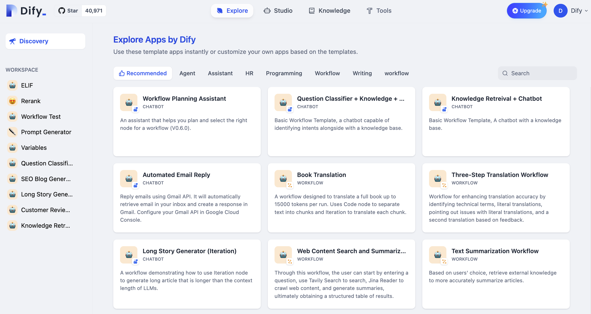

# کشف

## برنامه‌های الگو

در بخش **کشف**، چندین برنامه الگو پرکاربرد ارائه شده است. این برنامه‌ها حوزه‌هایی مانند منابع انسانی، دستیارها، ترجمه، برنامه‌نویسی و نوشتن را پوشش می‌دهند.

<figure><figcaption></figcaption></figure>

برای استفاده از یک برنامه الگو، روی دکمه "اضافه به فضای کاری" در الگو کلیک کنید. سپس می‌توانید از برنامه در فضای کاری سمت چپ استفاده کنید.

<figure><figcaption></figcaption></figure>

برای تغییر یک الگو و ایجاد یک برنامه جدید، روی دکمه "شخصی سازی" در الگو کلیک کنید.

## فضای کاری

فضای کاری به عنوان مسیریابی برای برنامه‌ها عمل می‌کند. برای استفاده مستقیم از یک برنامه، روی آن در فضای کاری کلیک کنید.

برنامه‌های موجود در فضای کاری شامل برنامه‌های شخصی شما و برنامه‌های افزوده شده به فضای کاری توسط سایر اعضای تیم است. 
