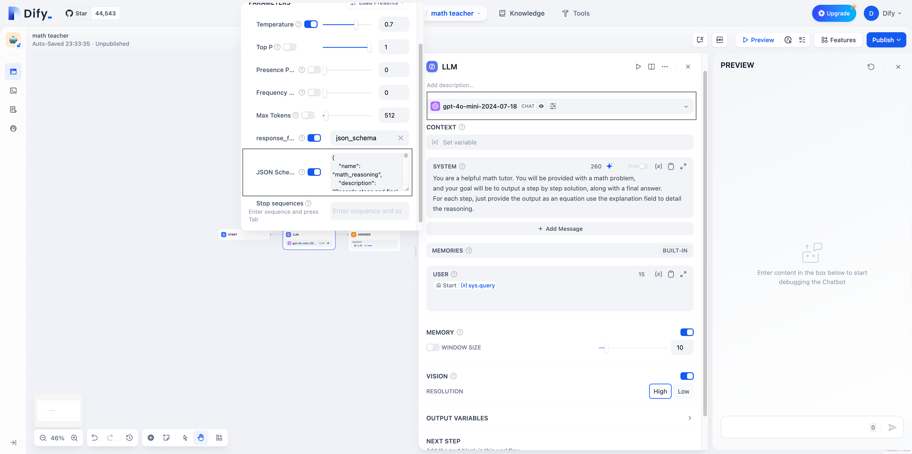
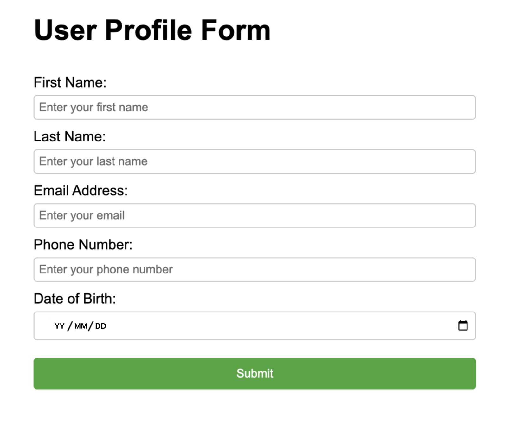

#  نحوه استفاده از خروجی JSON Schema در Dify

JSON Schema یک مشخصات برای توصیف ساختارهای داده JSON است. توسعه دهندگان می توانند ساختارهای JSON Schema را تعریف کنند تا مشخص کنند که خروجی LLM کاملاً مطابق با داده ها یا محتوا تعریف شده است، مانند تولید ساختارهای شفاف سند یا کد.

##  مدل هایی که از قابلیت JSON Schema پشتیبانی می کنند

*  `gpt-4o-mini-2024-07-18` و نسخه های بعدی
*  `gpt-4o-2024-08-06` و نسخه های بعدی

>  برای اطلاعات بیشتر در مورد قابلیت های خروجی ساخت یافته مدل های سری OpenAI، لطفاً به [خروجی های ساخت یافته](https://platform.openai.com/docs/guides/structured-outputs/introduction) مراجعه کنید.

##  نحوه استفاده از خروجی های ساخت یافته

1.  LLM را به ابزارها، توابع، داده ها و سایر اجزا در سیستم متصل کنید. `strict: true` را در تعریف تابع تنظیم کنید. با فعال شدن این ویژگی، قابلیت خروجی های ساخت یافته تضمین می کند که پارامترهای تولید شده توسط LLM برای تماس های تابع دقیقاً با JSON Schema که در تعریف تابع ارائه کرده اید مطابقت دارد.
2.  هنگامی که LLM به کاربران پاسخ می دهد، محتوا را در قالب ساخت یافته مطابق با تعاریف موجود در JSON Schema خروجی می دهد.

##  فعال کردن JSON Schema در Dify

LLM را در برنامه خود به یکی از مدل هایی که از خروجی JSON Schema پشتیبانی می کنند تغییر دهید. سپس، در فرم تنظیمات، `JSON Schema` را فعال کنید و الگوی JSON Schema را پر کنید. همزمان، ستون `response_format` را فعال کنید و آن را به فرمت `json_schema` تغییر دهید.



محتوای تولید شده توسط LLM از خروجی در فرمت زیر پشتیبانی می کند:

*  **متن:** خروجی در قالب متن

##  تعریف الگوهای JSON Schema

می توانید به فرمت JSON Schema زیر مراجعه کنید تا محتوای الگوی خود را تعریف کنید:

```json
{
    "name": "template_schema",
    "description": "یک الگوی عمومی برای JSON Schema",
    "strict": true,
    "schema": {
        "type": "object",
        "properties": {
            "field1": {
                "type": "string",
                "description": "توضیحات field1"
            },
            "field2": {
                "type": "number",
                "description": "توضیحات field2"
            },
            "field3": {
                "type": "array",
                "description": "توضیحات field3",
                "items": {
                    "type": "string"
                }
            },
            "field4": {
                "type": "object",
                "description": "توضیحات field4",
                "properties": {
                    "subfield1": {
                        "type": "string",
                        "description": "توضیحات subfield1"
                    }
                },
                "required": ["subfield1"],
                "additionalProperties": false
            }
        },
        "required": ["field1", "field2", "field3", "field4"],
        "additionalProperties": false
    }
}
```

راهنمای گام به گام:

1.  تعریف اطلاعات اولیه:
    *  `name` را تنظیم کنید: یک نام توصیفی برای طرح خود انتخاب کنید.
    *  `description` را اضافه کنید: هدف طرح را به طور خلاصه توضیح دهید.
    *  `strict` را روی true تنظیم کنید: برای اطمینان از حالت سختگیرانه.
2.  شی `schema` را ایجاد کنید:
    *  `type: "object"` را تنظیم کنید تا سطح ریشه به عنوان یک نوع شی مشخص شود.
    *  یک شی `properties` برای تعریف تمام فیلدها اضافه کنید.
3.  تعریف فیلدها:
    *  برای هر فیلد، از جمله `type` و `description`، یک شی ایجاد کنید.
    *  انواع رایج: `string`، `number`، `boolean`، `array`، `object`.
    *  برای آرایه ها، از `items` برای تعریف انواع عناصر استفاده کنید.
    *  برای اشیاء، `properties` را به طور بازگشتی تعریف کنید.
4.  تنظیم محدودیت ها:
    *  یک آرایه `required` در هر سطح اضافه کنید که تمام فیلدهای مورد نیاز را لیست کند.
    *  `additionalProperties: false` را در هر سطح شی تنظیم کنید.
5.  پردازش فیلدهای خاص:
    *  از `enum` برای محدود کردن مقادیر اختیاری استفاده کنید.
    *  از `$ref` برای پیاده سازی ساختارهای بازگشتی استفاده کنید.

##  مثال

###  1. زنجیره تفکر (routine)

**مثال JSON Schema**

```json
{
    "name": "math_reasoning",
    "description": "ثبت مراحل و پاسخ نهایی برای استدلال ریاضی",
    "strict": true,
    "schema": {
        "type": "object",
        "properties": {
            "steps": {
                "type": "array",
                "description": "آرایه ای از مراحل استدلال",
                "items": {
                    "type": "object",
                    "properties": {
                        "explanation": {
                            "type": "string",
                            "description": "توضیح مرحله استدلال"
                        },
                        "output": {
                            "type": "string",
                            "description": "خروجی مرحله استدلال"
                        }
                    },
                    "required": ["explanation", "output"],
                    "additionalProperties": false
                }
            },
            "final_answer": {
                "type": "string",
                "description": "پاسخ نهایی به مسئله ریاضی"
            }
        },
        "additionalProperties": false,
        "required": ["steps", "final_answer"]
    }
}
```

**راهنمایی ها**

```
شما یک معلم ریاضی مفید هستید. یک مسئله ریاضی به شما ارائه می شود،
و هدف شما این است که یک راه حل گام به گام، همراه با پاسخ نهایی را خروجی دهید.
برای هر مرحله، فقط خروجی را به عنوان یک معادله ارائه دهید. از فیلد توضیح برای جزئیات استدلال استفاده کنید.
```

###  تولید UI (حالت بازگشتی ریشه)

**مثال JSON Schema**

```json
{
        "name": "ui",
        "description": "UI به صورت پویا تولید شده",
        "strict": true,
        "schema": {
            "type": "object",
            "properties": {
                "type": {
                    "type": "string",
                    "description": "نوع جزء UI",
                    "enum": ["div", "button", "header", "section", "field", "form"]
                },
                "label": {
                    "type": "string",
                    "description": "برچسب جزء UI، برای دکمه ها یا فیلدهای فرم استفاده می شود"
                },
                "children": {
                    "type": "array",
                    "description": "اجزای UI تو در تو",
                    "items": {
                        "$ref": "#"
                    }
                },
                "attributes": {
                    "type": "array",
                    "description": "ویژگی های دلخواه برای جزء UI، مناسب برای هر عنصر",
                    "items": {
                        "type": "object",
                        "properties": {
                            "name": {
                                "type": "string",
                                "description": "نام ویژگی، به عنوان مثال onClick یا className"
                            },
                            "value": {
                                "type": "string",
                                "description": "مقدار ویژگی"
                            }
                        },
                      "additionalProperties": false,
                      "required": ["name", "value"]
                    }
                }
            },
            "required": ["type", "label", "children", "attributes"],
            "additionalProperties": false
        }
    }
```

**راهنمایی ها**

```
شما یک هوش مصنوعی تولید کننده UI هستید. ورودی کاربر را به یک UI تبدیل کنید.
```

**مثال خروجی:**



##  نکات

*  مطمئن شوید که راهنمایی برنامه شامل دستورالعمل هایی در مورد نحوه رسیدگی به مواردی است که ورودی کاربر نمی تواند پاسخ معتبر را تولید کند.
*  مدل همیشه تلاش می کند تا طرح ارائه شده را دنبال کند. اگر محتوای ورودی کاملاً با طرح مشخص شده ارتباطی نداشته باشد، ممکن است باعث توهم در LLM شود.
*  اگر LLM تشخیص دهد که ورودی با کار سازگار نیست، می توانید عباراتی را در راهنمایی برای مشخص کردن بازگشت پارامترهای خالی یا جملات خاص بگنجانید.
*  همه فیلدها باید `required` باشند. برای جزئیات، لطفاً به [طرح های پشتیبانی شده](https://platform.openai.com/docs/guides/structured-outputs/supported-schemas) مراجعه کنید.
*  `[additionalProperties: false]`(https://platform.openai.com/docs/guides/structured-outputs/additionalproperties-false-must-always-be-set-in-objects) باید همیشه در اشیاء تنظیم شود.
*  شیء سطح ریشه طرح باید یک شی باشد.

##  ضمیمه

*  [مقدمه ای بر خروجی های ساخت یافته](https://cookbook.openai.com/examples/structured\_outputs\_intro)
*  [خروجی ساخت یافته](https://platform.openai.com/docs/guides/structured-outputs/json-mode?context=without\_parse)


