# ساخت یک ربات تولید کننده  Prompt Midjourney با Dify

از طریق [@op7418](https://twitter.com/op7418) در توییتر

اخیرا یک ابزار برنامه نویسی زبان طبیعی به نام Dify را که توسط [@goocarlos](https://twitter.com/goocarlos) ساخته شده است، امتحان کردم. این ابزار به افراد بدون دانش کدنویسی اجازه می دهد تا فقط با نوشتن Prompts، یک برنامه وب بسازند. حتی API را برای شما تولید می کند، که باعث می شود استقرار برنامه شما در پلتفرم مورد نظر شما آسان شود.

برنامه ای که با استفاده از Dify ساختم، تنها 20 دقیقه طول کشید و نتایج آن چشمگیر بود. بدون Dify، رسیدن به همان نتیجه ممکن است زمان بسیار بیشتری از من می گرفت. عملکرد خاص این برنامه، تولید Prompts Midjourney بر اساس موضوعات کوتاه ورودی است که به کاربران در سریع پر کردن دستورات متداول Midjourney کمک می کند. در این راهنما، شما را در فرآیند ساخت این برنامه راهنمایی می کنم تا با این پلتفرم آشنا شوید.

Dify دو نوع برنامه را ارائه می دهد: برنامه های مکالمه ای مشابه ChatGPT که شامل دیالوگ های چند دور است و برنامه های تولید متن که مستقیما با یک کلیک، محتوای متنی تولید می کنند. از آنجایی که می خواهیم یک ربات تولید کننده  Prompt Midjourney  بسازیم،  generator متن را انتخاب خواهیم کرد.

می توانید به Dify از اینجا دسترسی پیدا کنید: https://dify.ai/

<figure>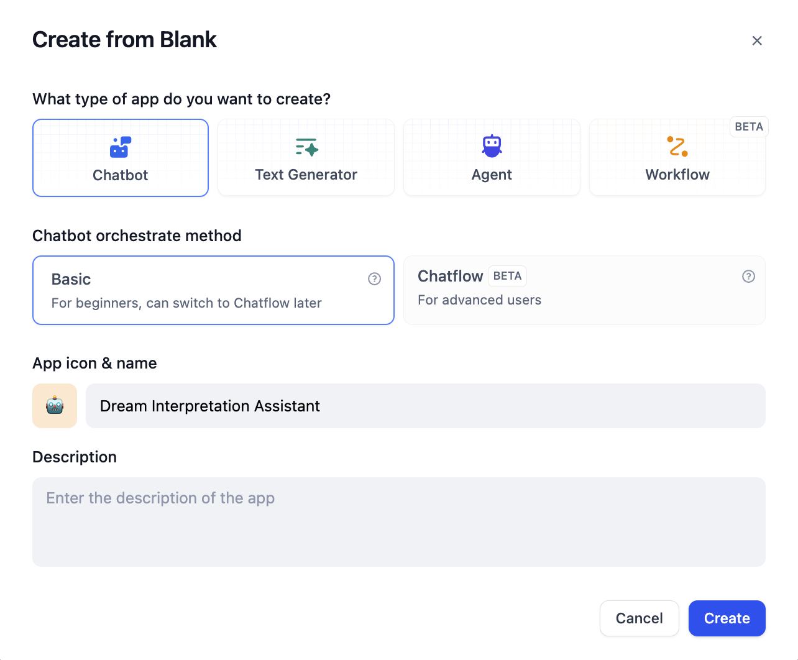<figcaption></figcaption></figure>

پس از ایجاد برنامه خود، صفحه داشبورد برخی از داده های نظارت و تنظیمات برنامه را نشان می دهد. روی "مهندسی Prompt" در سمت چپ، که صفحه اصلی کار است، کلیک کنید.

<figure>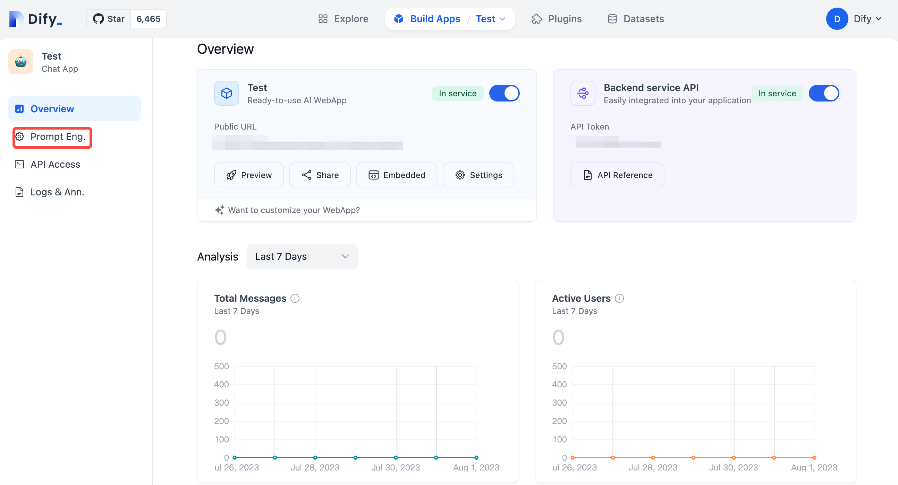<figcaption></figcaption></figure>

در این صفحه، سمت چپ برای تنظیمات Prompt و سایر توابع است، در حالی که سمت راست پیش نمایش ها و استفاده های زمان واقعی از محتوای ساخته شده توسط شما را ارائه می دهد. Prompts پیشوند، محرک هایی هستند که کاربر پس از هر محتوا وارد می کند و به مدل GPT دستور می دهند که چگونه اطلاعات ورودی کاربر را پردازش کند.

<figure>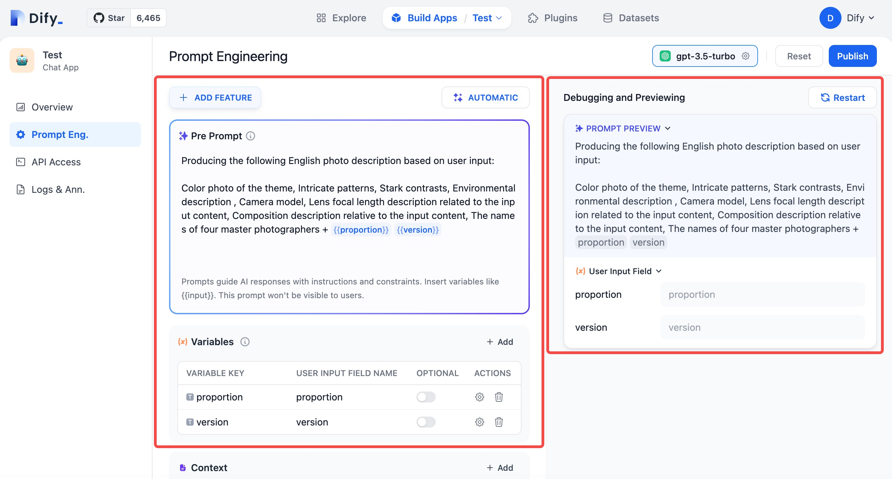<figcaption></figcaption></figure>

ساختار Prompt پیشوند من را بررسی کنید: قسمت اول GPT را راهنمایی می کند تا یک توصیف از عکس را در ساختار زیر خروجی کند. ساختار دوم به عنوان الگویی برای تولید Prompt عمل می کند، که عمدتا شامل عناصری مانند "عکس رنگی از موضوع"، "الگوهای پیچیده"، "کنتراست های شدید"، "شرح محیطی"، "مدل دوربین"، "شرح طول کانونی لنز مربوط به محتوای ورودی"، "شرح ترکیب بندی مربوط به محتوای ورودی" و "نام چهار عکاس برجسته" است. اینها محتوای اصلی Prompt را تشکیل می دهند. از نظر تئوری، شما می توانید این را در ناحیه پیش نمایش در سمت راست ذخیره کنید، موضوعی را که می خواهید تولید کنید وارد کنید، و Prompt مربوطه تولید خواهد شد.

<figure>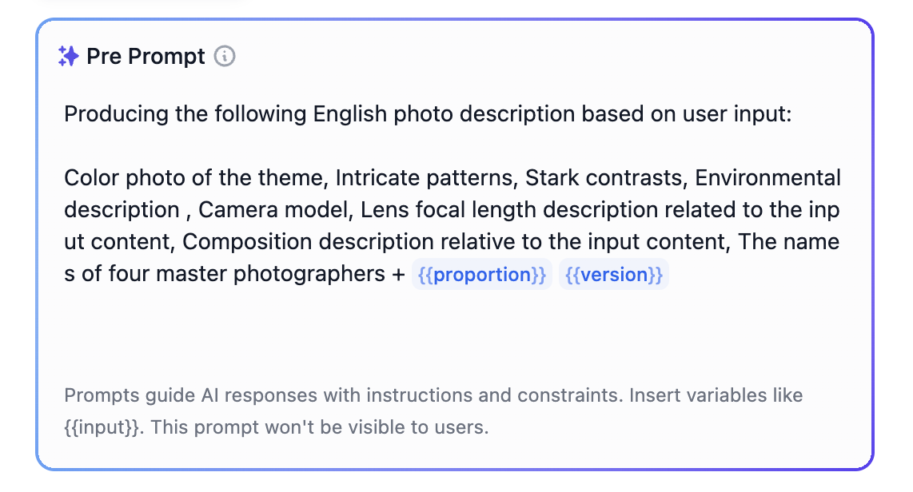<figcaption></figcaption></figure>

شاید متوجه "\{{proportion\}}" و "\{{version\}}" در انتها شده باشید. اینها متغیرهایی هستند که برای ارسال اطلاعات انتخاب شده توسط کاربر استفاده می شوند. در سمت راست، کاربران باید تناسبات تصویر و نسخه های مدل را انتخاب کنند و این دو متغیر به حمل این اطلاعات به انتهای Prompt کمک می کنند. بیایید ببینیم چگونه آنها را تنظیم کنیم.

<figure>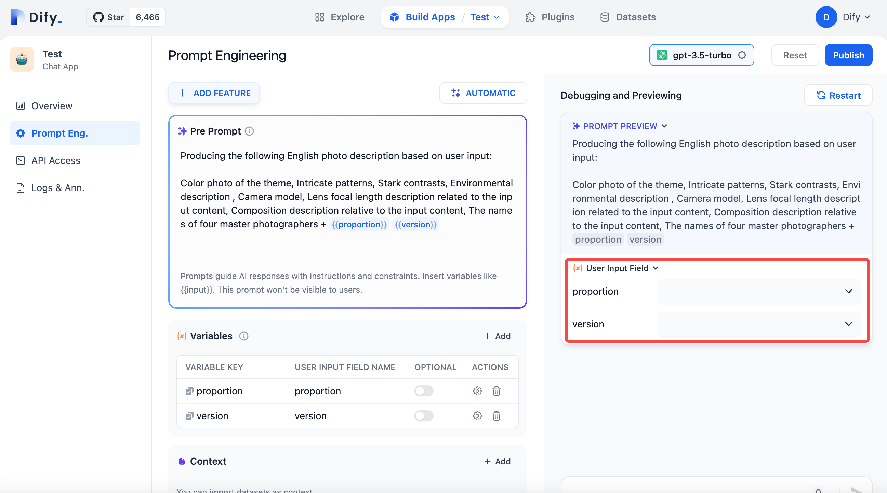<figcaption></figcaption></figure>

هدف ما پر کردن اطلاعات انتخاب شده توسط کاربر در انتهای Prompt است که باعث می شود کاربران بدون نیاز به بازنویسی یا حفظ این دستورات، به راحتی آن را کپی کنند. برای این منظور، از تابع متغیر استفاده می کنیم.

متغیرها به ما این امکان را می دهند تا محتوای انتخاب شده یا پر شده توسط کاربر را به طور پویا در Prompt ادغام کنیم. به عنوان مثال، من دو متغیر ایجاد کرده ام: یکی نشان دهنده تناسبات تصویر است و دیگری نشان دهنده نسخه مدل است. برای ایجاد متغیرها، روی دکمه "اضافه کردن" کلیک کنید.

<figure>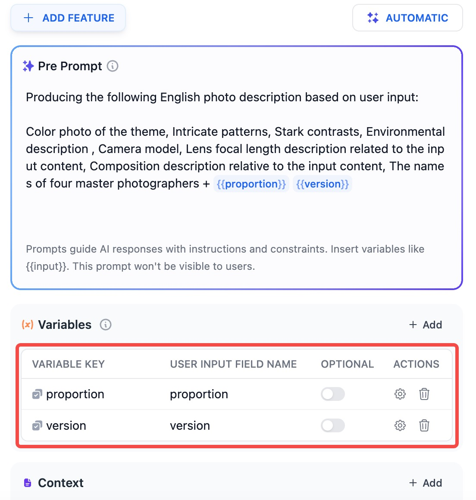<figcaption></figcaption></figure>

بعد از ایجاد، باید کلید متغیر و نام فیلد را پر کنید. کلید متغیر باید به انگلیسی باشد. تنظیم اختیاری به این معنی است که فیلد در هنگام پر کردن توسط کاربر، اجباری نخواهد بود. سپس، روی "تنظیمات" در نوار اقدام کلیک کنید تا محتوای متغیر را تنظیم کنید.

<figure>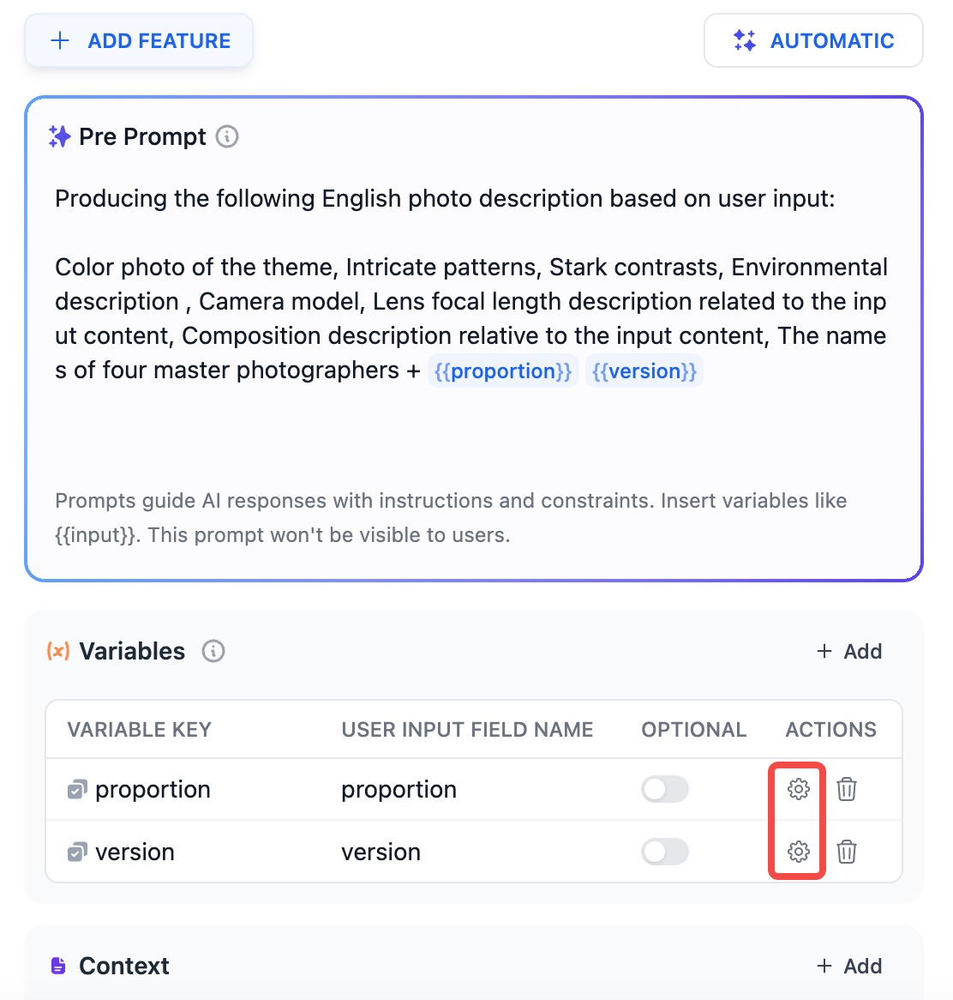<figcaption></figcaption></figure>

متغیرها می توانند از دو نوع باشند: متغیرهای متنی که کاربران به صورت دستی محتوای آن را وارد می کنند و گزینه های انتخابی که کاربران از بین گزینه های داده شده انتخاب می کنند. از آنجایی که می خواهیم از دستورات دستی اجتناب کنیم، گزینه کشویی را انتخاب می کنیم و گزینه های مورد نیاز را اضافه می کنیم.

<figure>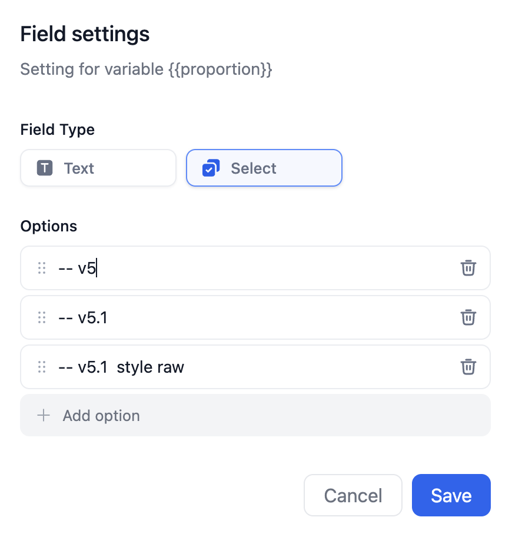<figcaption></figcaption></figure>

حالا بیایید از متغیرها استفاده کنیم. باید کلید متغیر را درون دو آکولاد {} محصور کنیم و آن را به Prompt پیشوند اضافه کنیم. از آنجایی که می خواهیم GPT محتوای انتخاب شده توسط کاربر را همانطور که هست خروجی دهد، عبارت "تولید توصیف عکس انگلیسی زیر بر اساس ورودی کاربر" را در Prompt قرار می دهیم.

<figure>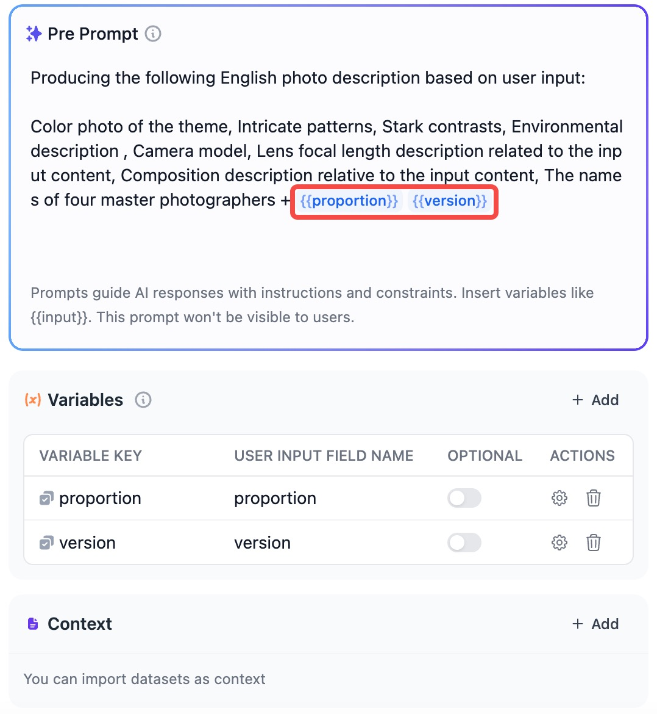<figcaption></figcaption></figure>

با این حال، هنوز احتمال اینکه GPT محتوای متغیر ما را تغییر دهد وجود دارد. برای رفع این مشکل، می توانیم تنوع را در انتخاب مدل در سمت راست کاهش دهیم، درجه حرارت را کم کنیم و احتمال تغییر محتوای متغیر ما را کاهش دهیم. می توانید معنی سایر پارامترها را در راهنماها بررسی کنید.

<figure>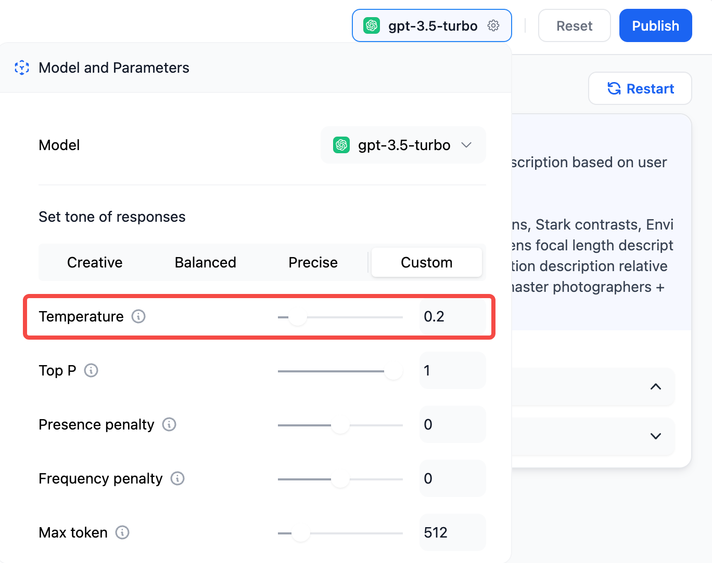<figcaption></figcaption></figure>

با این مراحل، برنامه شما اکنون کامل شده است. پس از تست و اطمینان از اینکه هیچ مشکلی با خروجی وجود ندارد، برای انتشار برنامه خود، روی دکمه "انتشار" در گوشه بالا سمت راست کلیک کنید. شما و کاربران می توانید از طریق URL در دسترس عموم به برنامه خود دسترسی پیدا کنید. همچنین می توانید نام برنامه، مقدمه، آیکون و سایر جزئیات را در تنظیمات سفارشی کنید.

<figure>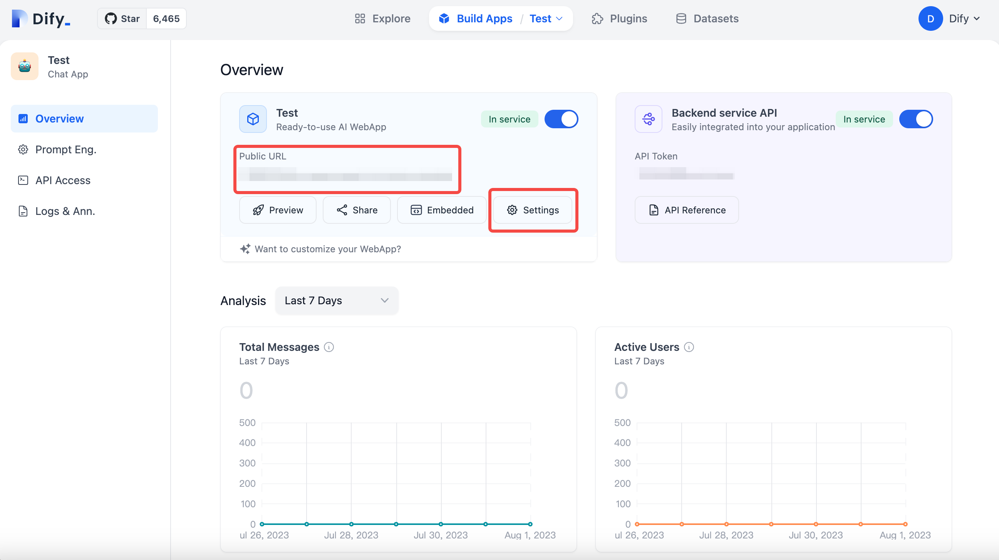<figcaption></figcaption></figure>

این نحوه ساخت یک برنامه هوش مصنوعی ساده با استفاده از Dify است. همچنین می توانید برنامه خود را در پلتفرم های دیگر استقرار دهید یا رابط کاربری آن را با استفاده از API تولید شده، اصلاح کنید. علاوه بر این، Dify از آپلود داده های شما، مانند ساخت یک ربات خدمات مشتری برای کمک به پرسش های مربوط به محصول پشتیبانی می کند. این پایان راهنما است و از @goocarlos برای ساخت چنین محصول فوق العاده ای تشکر ویژه می کنم.

