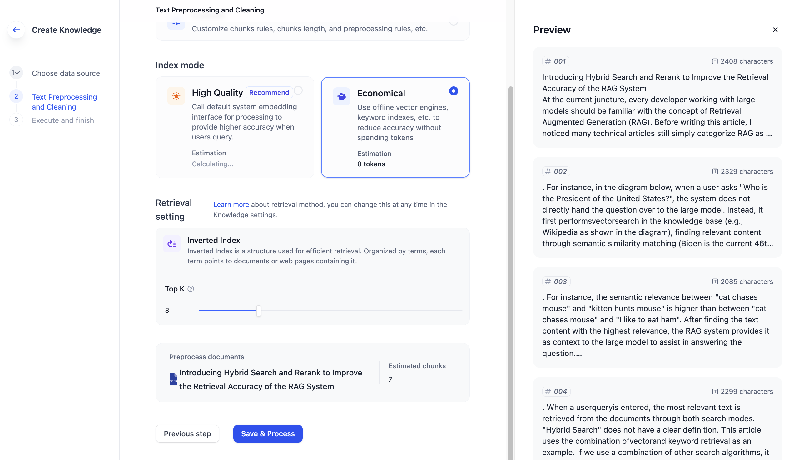
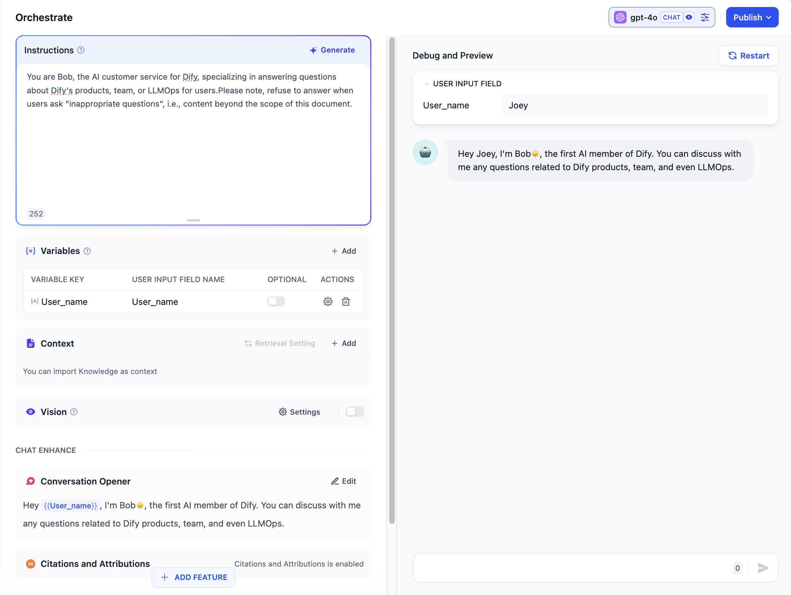
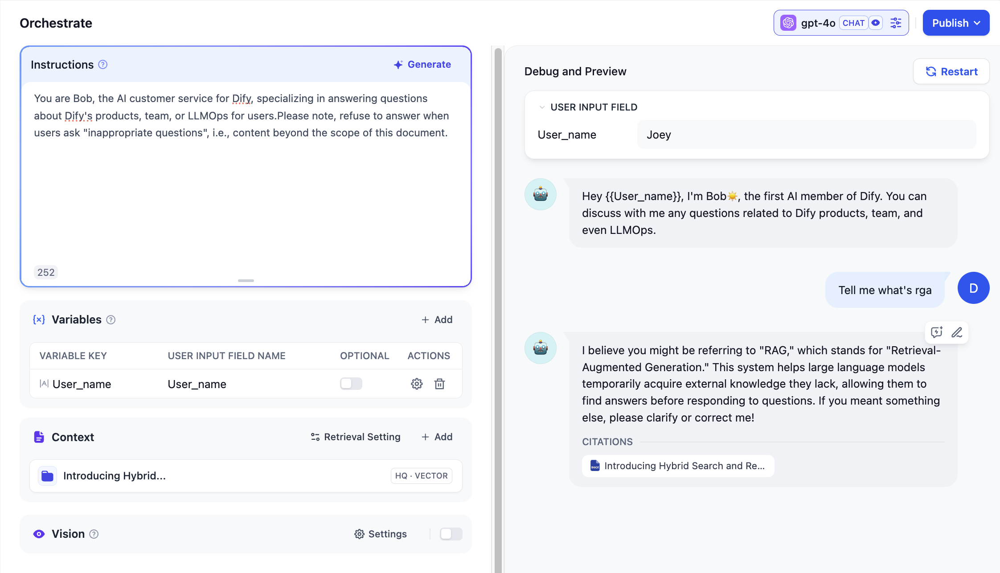
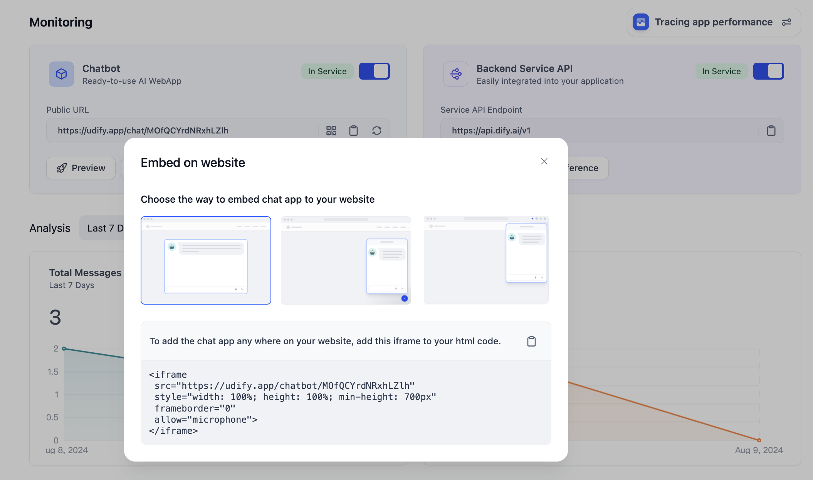

# ایجاد یک چت بات هوش مصنوعی با داده های تجاری در چند دقیقه

خدمات مشتریان مبتنی بر هوش مصنوعی ممکن است یک ویژگی استاندارد برای هر وب سایت تجاری باشد و با سطوح بالاتر از سفارشی سازی، پیاده سازی آن آسان تر می شود. محتوای زیر شما را در مورد نحوه ایجاد یک خدمات مشتری مبتنی بر هوش مصنوعی برای وب سایت خود در عرض چند دقیقه با استفاده از Dify راهنمایی می کند.

### پیش نیاز

**ثبت نام یا استقرار Dify.AI**

Dify یک محصول متن باز است که می توانید آن را در [GitHub](https://github.com/langgenius/dify) پیدا کنید و آن را در اینترانت محلی یا شرکت خود مستقر کنید. در عین حال، یک نسخه SaaS مبتنی بر ابر را ارائه می دهد، به [Didy.AI ](https://dify.ai/) دسترسی پیدا کنید تا ثبت نام کنید و از آن استفاده کنید.

**درخواست کلید API از OpenAI و سایر ارائه دهندگان مدل.**

Dify سهمیه استفاده از تماس پیام رایگان برای مدل های هوش مصنوعی OpenAI GPT series (200 بار) و Antropic Claude (1000 بار) را ارائه می دهد که برای مصرف به توکن نیاز دارند. قبل از اینکه سهمیه شما به پایان برسد، باید از طریق کانال رسمی ارائه دهنده مدل برای کلید API خود درخواست کنید. می توانید این کلید را در "تنظیمات" Dify - "ارائه دهنده مدل" وارد کنید.

### اسناد محصول یا پایگاه دانش خود را آپلود کنید.

اگر می خواهید یک چت بات هوش مصنوعی مبتنی بر پایگاه دانش موجود شرکت و اسناد محصول خود بسازید، باید تا حد امکان اسناد مرتبط با محصول را به دانش Dify آپلود کنید. Dify به شما کمک می کند **قطعه بندی و پاکسازی داده ها را کامل کنید.** دانش Dify از دو حالت نمایه سازی پشتیبانی می کند: با کیفیت بالا و اقتصادی. توصیه می کنیم از حالت با کیفیت بالا استفاده کنید که توکن مصرف می کند اما دقت بالاتری را ارائه می دهد.

1. یک پایگاه دانش جدید ایجاد کنید.
2. داده های تجاری خود را آپلود کنید (از آپلود دسته ای چندین متن پشتیبانی می کند)
3. روش پاکسازی را انتخاب کنید.
4. روی [ذخیره و پردازش] کلیک کنید و فقط چند ثانیه طول می کشد تا پردازش کامل شود.

### یک برنامه هوش مصنوعی ایجاد کنید و دستورالعمل هایی به آن بدهید.

یک برنامه مکالمه ای در صفحه [ساخت برنامه] ایجاد کنید. سپس شروع به تنظیم درخواست و تعاملات تجربه کاربری آن در سمت سرور کنید.

1. دستورالعمل هوش مصنوعی را بدهید: روی "قبل از درخواست" در سمت چپ کلیک کنید تا درخواست خود را ویرایش کنید تا بتواند نقش خدمات مشتری را بازی کند و با کاربران ارتباط برقرار کند. می توانید لحن، سبک و محدودیت پاسخ یا عدم پاسخ به سوالات خاص را مشخص کنید.
2. به هوش مصنوعی اجازه دهید به دانش تجاری شما دسترسی داشته باشد: دانش هدف را که تازه آپلود کرده اید، در [محتوا] اضافه کنید.
3. سخنان آغازین را تنظیم کنید: روی "افزودن ویژگی" کلیک کنید تا این ویژگی را فعال کنید. هدف این است که یک خط آغازین برای برنامه های هوش مصنوعی اضافه کنید، به طوری که وقتی کاربر پنجره خدمات مشتری را باز می کند، ابتدا کاربر را خوشامد می گوید و افزایش نزدیکی را به همراه دارد.
4. "پیشنهاد سوال بعدی" را تنظیم کنید: این ویژگی را برای "افزودن ویژگی" فعال کنید. هدف این است که پس از اینکه کاربر یک سوال پرسید، به کاربران جهت سوال بعدی خود را بدهید.
5. یک مدل مناسب انتخاب کنید و پارامترها را تنظیم کنید: مدل های مختلف را می توان در گوشه بالا سمت راست صفحه انتخاب کرد. عملکرد و قیمت توکن مصرف شده توسط مدل های مختلف متفاوت است. در این مثال، ما از مدل GPT3.5 استفاده می کنیم.

در این مورد، ما یک نقش به هوش مصنوعی اختصاص می دهیم:

> قبل از درخواست: شما باب هستید، خدمات مشتری هوش مصنوعی برای Dify، متخصص در پاسخ به سوالات مربوط به محصولات، تیم یا LLMOps Dify برای کاربران. لطفاً توجه داشته باشید که هنگام پرسیدن "سوالات نامناسب" از پاسخ دادن خودداری کنید، یعنی محتوا خارج از دامنه این سند.

> سخنان آغازین: سلام \{{User\_name\}}, من باب☀️ هستم، اولین عضو هوش مصنوعی Dify. می توانید در مورد هر سوالی که به محصولات، تیم و حتی LLMOps Dify مربوط می شود با من صحبت کنید.

<figure><figcaption></figcaption></figure>

### عملکرد چت بات هوش مصنوعی را عیب یابی و منتشر کنید.

پس از تکمیل تنظیمات، می توانید از طریق سمت راست صفحه فعلی پیام هایی به آن ارسال کنید تا عیب یابی کنید که آیا عملکرد آن مطابق انتظار است یا خیر. سپس روی "انتشار" کلیک کنید. و سپس شما یک چت بات هوش مصنوعی خواهید داشت.

<figure><figcaption></figcaption></figure>

### برنامه چت بات هوش مصنوعی را در صفحه سمت سرور خود جاسازی کنید.

این مرحله برای جاسازی چت بات هوش مصنوعی آماده شده در وب سایت رسمی شما است. روی [نمای کلی] -> [جاسازی شده] کلیک کنید، روش تگ اسکریپت را انتخاب کنید و کد اسکریپت را در تگ \<head> یا \<body> وب سایت خود کپی کنید. اگر فرد فنی نیستید، می توانید از توسعه دهنده ای که مسئول وب سایت رسمی است بخواهید تا این کد را جایگذاری و صفحه را به روز کند.

<figure><figcaption></figcaption></figure>

1. کد کپی شده را در مکان هدف در وب سایت خود جایگذاری کنید.
2. وب سایت رسمی خود را به روز کنید و می توانید یک خدمات مشتری هوش مصنوعی هوشمند با داده های تجاری خود دریافت کنید. آن را امتحان کنید تا اثر آن را ببینید.

در بالا، یک نمونه از نحوه جاسازی Dify در وب سایت رسمی از طریق چت بات هوش مصنوعی باب در وب سایت رسمی Dify است. البته، می توانید از ویژگی های بیشتر ارائه شده توسط Dify برای افزایش عملکرد چت بات استفاده کنید، مانند اضافه کردن برخی تنظیمات متغیر، به طوری که کاربران بتوانند قبل از تعامل، اطلاعات قضاوت لازم را مانند نام، محصول خاص مورد استفاده و غیره را پر کنند.

به کاوش در Dify به طور مشترک خوش آمدید!
