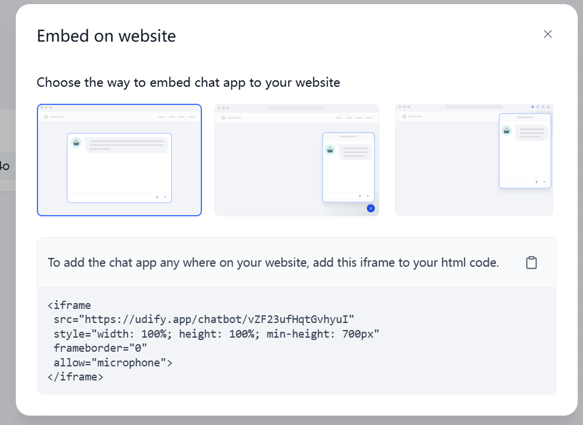
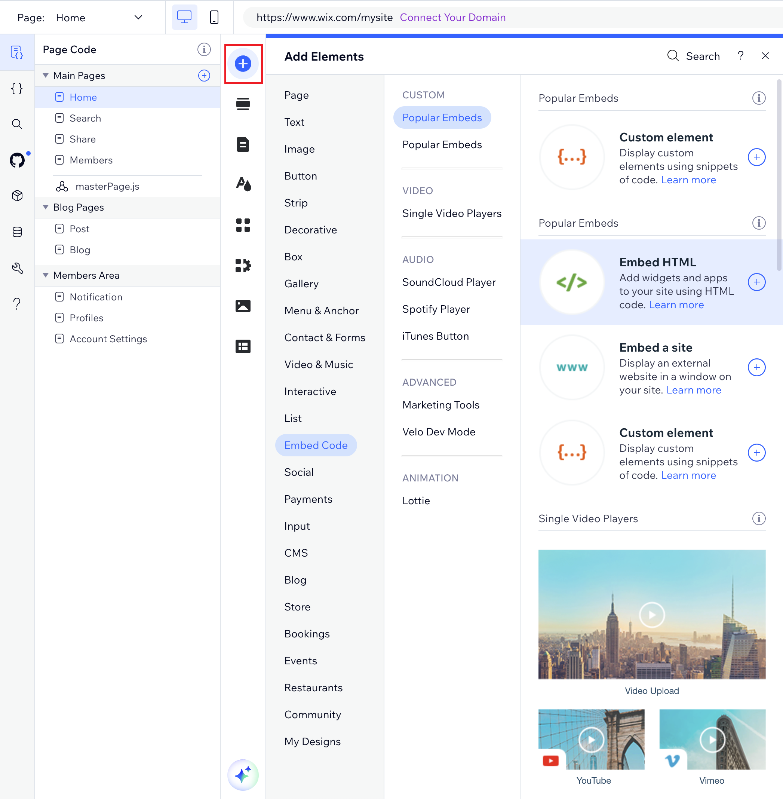

# ادغام چت‌بات Dify در وب‌سایت Wix

Wix یک پلتفرم محبوب ساخت وب‌سایت است که به کاربران اجازه می‌دهد وب‌سایت‌های خود را به صورت بصری و با استفاده از قابلیت کشیدن و رها کردن طراحی کنند. با استفاده از قابلیت کد iframe Wix، می‌توانید به سادگی یک چت‌بات Dify را در سایت Wix خود ادغام کنید.

این قابلیت فراتر از ادغام چت‌بات است و به شما امکان می‌دهد محتوا را از سرورهای خارجی و منابع دیگر در صفحات Wix خود نمایش دهید. به عنوان مثال، می‌توانید از ویجت‌های هواشناسی، تیک‌های سهام، تقویم‌ها یا هر عنصر وب سفارشی استفاده کنید.

این راهنما شما را در فرآیند ادغام یک چت‌بات Dify در وب‌سایت Wix خود با استفاده از کد iframe راهنمایی می‌کند. این روش مشابه برای ادغام برنامه‌های Dify در سایر وب‌سایت‌ها، وبلاگ‌ها یا صفحات وب نیز قابل استفاده است.

## 1.  بدست آوردن کد اسنیپت iFrame برنامه Dify

با فرض اینکه شما قبلاً یک [برنامه Dify AI](https://docs.dify.ai/guides/application-orchestrate/creating-an-application) ایجاد کرده‌اید، مراحل زیر را برای دریافت کد اسنیپت iFrame دنبال کنید:

1.  وارد حساب Dify خود شوید.
2.  برنامه Dify که می‌خواهید آن را ادغام کنید، انتخاب کنید.
3.  روی دکمه "Publish" در گوشه بالا سمت راست کلیک کنید.
4.  در صفحه انتشار، گزینه "Embed Into Site" را انتخاب کنید.

    
5.  یک سبک مناسب را انتخاب کرده و کد iFrame نمایش داده شده را کپی کنید. به عنوان مثال:

    

## 2.  ادغام کد اسنیپت iFrame در سایت Wix شما

1.  وارد وب‌سایت Wix خود شوید و صفحه‌ای را که می‌خواهید ویرایش کنید، باز کنید.
2.  روی دکمه آبی `+` (Add Elements) در سمت چپ صفحه کلیک کنید.
3.  **Embed Code** را انتخاب کنید، سپس روی **Embed HTML** کلیک کنید تا یک عنصر HTML iFrame به صفحه اضافه شود.

    
4.  در جعبه "HTML Settings"، گزینه "Code" را انتخاب کنید.
5.  کد اسنیپت iFrame را که از برنامه Dify خود دریافت کرده‌اید، پیست کنید.
6.  برای ذخیره و پیش‌نمایش تغییرات خود، روی دکمه **Update** کلیک کنید.

در اینجا یک نمونه از کد اسنیپت iFrame برای ادغام یک چت‌بات Dify آورده شده است:

```bash
<iframe src="https://udify.app/chatbot/ez1pf83HVV3JgWO4" style="width: 100%; height: 100%; min-height: 700px" frameborder="0" allow="microphone"></iframe>
```


> ⚠️ مطمئن شوید که آدرس در کد iFrame با HTTPS شروع شود. آدرس‌های HTTP به درستی نمایش داده نمی‌شوند.

## 3.  سفارشی‌سازی چت‌بات Dify خود

می‌توانید سبک دکمه، موقعیت و سایر تنظیمات چت‌بات Dify را تنظیم کنید.

### 3.1  سفارشی‌سازی سبک

ویژگی `style` را در کد iFrame تغییر دهید تا ظاهر دکمه Chatbot را سفارشی کنید. به عنوان مثال:

```bash
<iframe src="https://udify.app/chatbot/ez1pf83HVV3JgWO4" style="width: 100%; height: 100%; min-height: 700px" frameborder="0" allow="microphone"></iframe>

# Adding a 2-pixel wide solid black border: border: 2px solid #000

→

<iframe src="https://udify.app/chatbot/ez1pf83HVV3JgWO4" style="width: 80%; height: 80%; min-height: 500px; border: 2px solid #000;" frameborder="0" allow="microphone"></iframe>
```

این کد یک حاشیه سیاه جامد 2 پیکسل به رابط کاربری چت‌بات اضافه می‌کند.

### 3.2  سفارشی‌سازی موقعیت

با تغییر مقدار `position` در ویژگی `style`، موقعیت دکمه را تنظیم کنید. به عنوان مثال:

```bash
<iframe src="https://udify.app/chatbot/ez1pf83HVV3JgWO4" style="width: 100%; height: 100%; min-height: 700px" frameborder="0" allow="microphone"></iframe>

# Fixing the Chatbot to the bottom right corner of the webpage, 20 pixels from the bottom and right edges.

→

<iframe src="https://udify.app/chatbot/ez1pf83HVV3JgWO4" style="width: 100%; height: 100%; min-height: 700px; position: fixed; bottom: 20px; right: 20px;" frameborder="0" allow="microphone"></iframe>
```

این کد چت‌بات را در گوشه پایین سمت راست صفحه وب، 20 پیکسل از لبه‌های پایین و راست ثابت می‌کند.

##  سؤالات متداول

**1.  محتوای iFrame نمایش داده نمی‌شود.**

*  تأیید کنید که URL با HTTPS شروع می‌شود.
*  برای خطاهای تایپی در کد `iframe` جستجو کنید.
*  تأیید کنید که محتوای ادغام شده با سیاست‌های امنیتی Wix مطابقت دارد.

**2.  محتوای iFrame بریده شده است.**

برای حل مشکلات بریدگی محتوا، مقادیر درصد `width` و `height` را در کد `iframe` تغییر دهید.


