# چطور یک برنامه‌ی هوش مصنوعی برای تولید تصویر بسازیم؟

> نویسنده: استیون لین. نویسنده‌ی فنی دایفی.

با افزایش محبوبیت تولید تصویر، محصولات فوق‌العاده‌ای مثل دالی، فلکس، انتشار پایدار، و غیره پدیدار شده‌اند.

در این مقاله، یاد می‌گیرید چطور با استفاده از دایفی، یک برنامه‌ی هوش مصنوعی برای تولید تصویر بسازید.

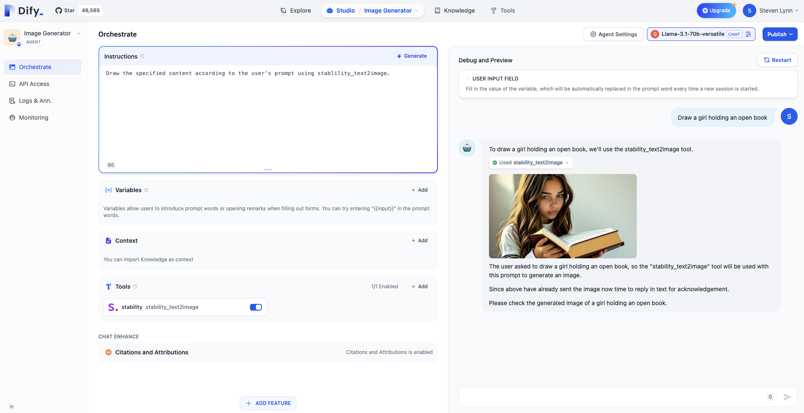

## یاد می‌گیرید

* روش‌های ساخت یک عامل با استفاده از دایفی
* مفاهیم پایه‌ای عامل
* اصول اولیه‌ی مهندسی پروم‌پت
* استفاده از ابزار
* مفاهیم توهم مدل‌های بزرگ

## ۱. تنظیم کلید API پایداری

[اینجا را کلیک کنید](https://platform.stability.ai/account/keys) تا به صفحه‌ی مدیریت کلید API پایداری بروید.

اگر هنوز ثبت نام نکرده‌اید، قبل از ورود به صفحه‌ی مدیریت API، از شما خواسته می‌شود که ثبت نام کنید.

پس از ورود به صفحه‌ی مدیریت، برای کپی کردن کلید، روی `کپی` کلیک کنید.


سپس، باید این کلید را در [Dify - Tools - Stability](https://cloud.dify.ai/tools) با دنبال کردن این مراحل وارد کنید:

* وارد دایفی شوید.
* وارد Tools شوید.
* Stability را انتخاب کنید.
* روی `مجوز` کلیک کنید.

&#x20;


* کلید را وارد کنید و ذخیره کنید.

## ۲. تنظیم ارائه دهندگان مدل

برای بهینه‌سازی تعامل، به یک LLM نیاز داریم تا دستورالعمل‌های کاربر را به طور مشخص، یعنی برای نوشتن پروم‌پت برای تولید تصاویر، مشخص کند. سپس، ارائه دهندگان مدل را در دایفی با دنبال کردن این مراحل تنظیم می‌کنیم.

نسخه رایگان دایفی، ۲۰۰ اعتبار پیام رایگان OpenAI ارائه می‌دهد.

اگر اعتبارات پیام کافی نیستند، می‌توانید با دنبال کردن مراحل نشان داده شده در تصویر زیر، سایر ارائه دهندگان مدل را سفارشی کنید:

روی **آواتار شما - تنظیمات - ارائه دهنده مدل** کلیک کنید.

<figure>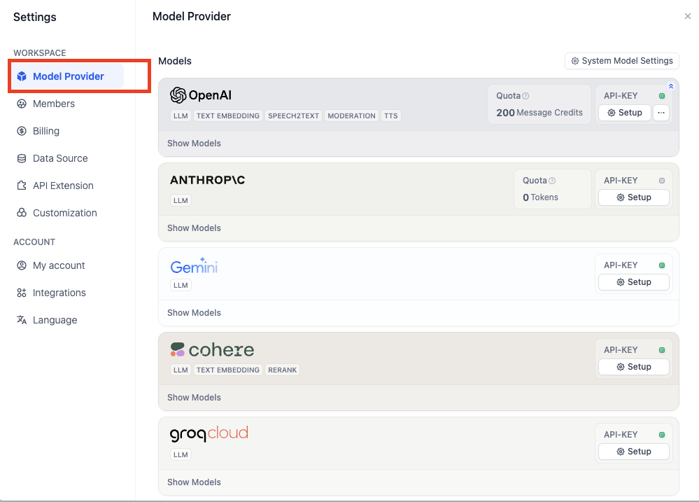<figcaption></figcaption></figure>

اگر ارائه دهنده‌ی مدلی که می‌خواهید پیدا نکردید، پلتفرم groq اعتبارات تماس رایگان برای LLM ها مثل Llama ارائه می‌دهد.

وارد [صفحه‌ی مدیریت API groq](https://console.groq.com/keys) شوید.

روی **ایجاد کلید API** کلیک کنید، یک نام دلخواه را تنظیم کنید، و کلید API را کپی کنید.

به **Dify - ارائه دهندگان مدل** برگردید، **groqcloud** را انتخاب کنید، و روی **تنظیم** کلیک کنید.

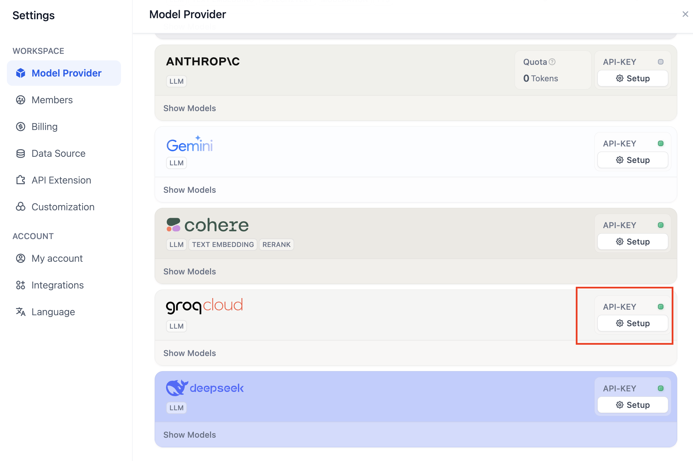

کلید API را چسبانده و ذخیره کنید.

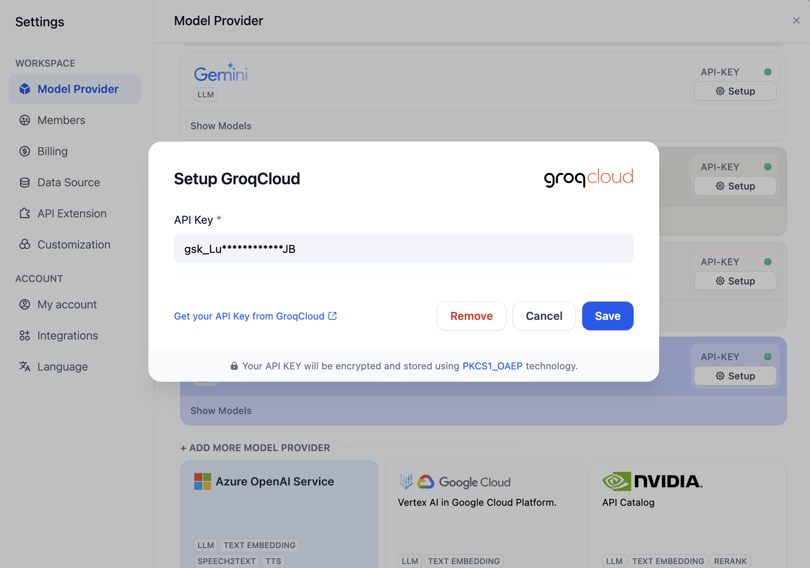

## ۳. ساخت یک عامل

به **Dify - Studio** برگردید، **ایجاد از خالی** را انتخاب کنید.

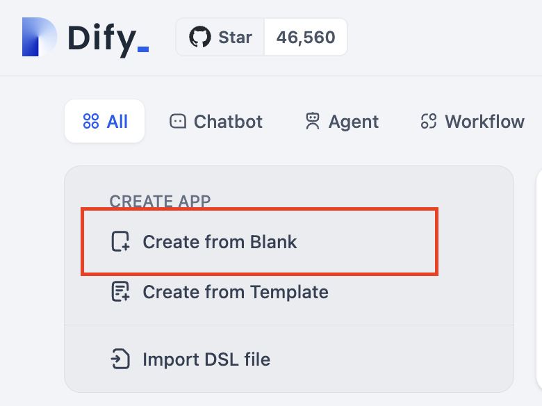

در این آزمایش، فقط باید با استفاده‌ی اساسی از عامل آشنا شویم.


**عامل چیست؟**

یک عامل، یک سیستم هوش مصنوعی است که رفتار و قابلیت‌های انسان را شبیه‌سازی می‌کند. این سیستم از طریق پردازش زبان طبیعی با محیط تعامل برقرار می‌کند، اطلاعات ورودی را درک می‌کند و خروجی‌های متناظر را تولید می‌کند. عامل همچنین قابلیت‌های "درک" دارد، می‌تواند انواع مختلف داده‌ها را پردازش و تجزیه و تحلیل کند، و می‌تواند ابزارها و API‌های مختلف خارجی را برای انجام وظایف فراخوانی و استفاده کند، که دامنه‌ی عملکردی آن را گسترش می‌دهد. این طراحی به عامل اجازه می‌دهد تا به طور انعطاف‌پذیرتر با موقعیت‌های پیچیده کنار بیاید و تا حدودی تفکر و الگوهای رفتاری انسان را شبیه‌سازی کند.


**عامل** را انتخاب کنید، نام آن را وارد کنید.

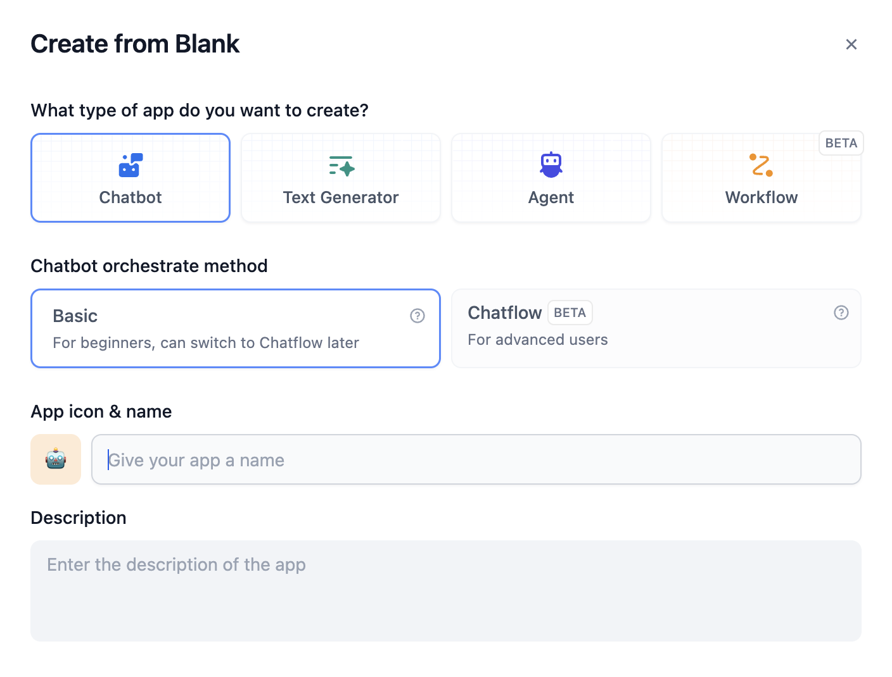

سپس، وارد رابط ارکستراسیون عامل می‌شوید که در زیر نشان داده شده است.

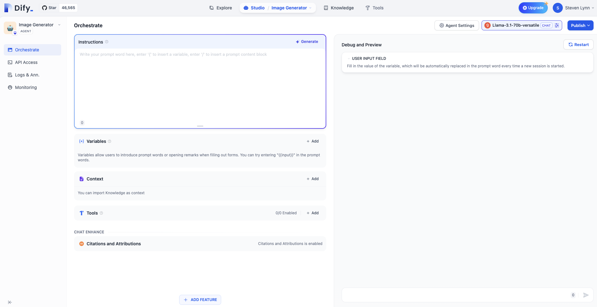

LLM را انتخاب کنید. در اینجا، ما از Llama-3.1-70B که توسط groq ارائه شده، به عنوان مثال استفاده می‌کنیم:

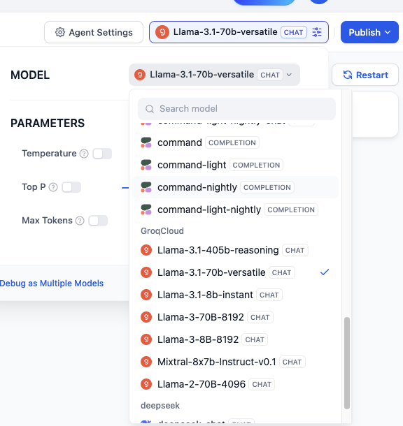

Stability را در **Tools** انتخاب کنید:

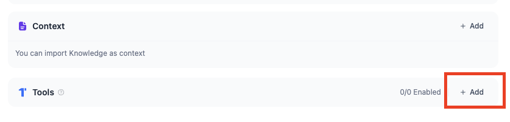

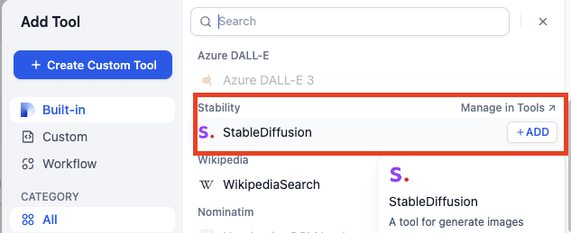

### نوشتن پروم‌پت‌ها

پروم‌پت‌ها روح عامل هستند و به طور مستقیم بر اثر خروجی تاثیر می‌گذارند. به طور کلی، هرچه پروم‌پت‌ها دقیق‌تر باشند، خروجی بهتر خواهد بود، اما پروم‌پت‌های بیش از حد طولانی نیز می‌تواند منجر به اثرات منفی شود.

مهندسی تنظیم پروم‌پت‌ها، مهندسی پروم‌پت نامیده می‌شود.

در این آزمایش، نیازی نیست نگران عدم تسلط بر مهندسی پروم‌پت باشید. ما بعداً به تدریج آن را یاد می‌گیریم.

با ساده‌ترین پروم‌پت‌ها شروع می‌کنیم:

```
با استفاده از stability_text2image، محتوای مشخص شده را با توجه به پروم‌پت کاربر بکشید.
```

هر بار که کاربر یک دستور را وارد می‌کند، عامل این دستورالعمل سطح سیستم را می‌شناسد، در نتیجه می‌فهمد که هنگام اجرای یک وظیفه‌ی نقاشی توسط کاربر، باید ابزار stability را فراخوانی کند.

به عنوان مثال: یک دختر را بکشید که یک کتاب باز در دست دارد.


### آیا نمی‌خواهید پروم‌پت بنویسید؟ البته که می‌توانید!

روی **تولید** در گوشه‌ی بالا سمت راست Instructions کلیک کنید.

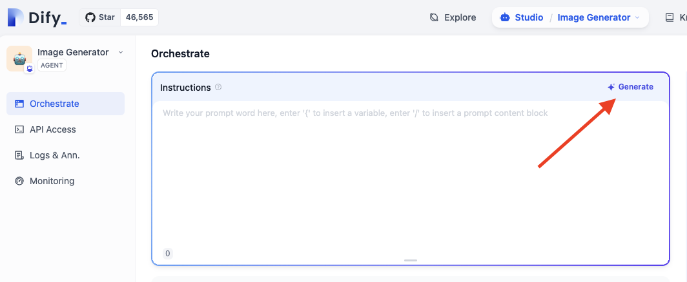

نیازهای خود را در **Instructions** وارد کنید و روی **تولید** کلیک کنید. پروم‌پت‌های تولید شده در سمت راست، پروم‌پت‌های تولید شده توسط هوش مصنوعی را نشان می‌دهند.

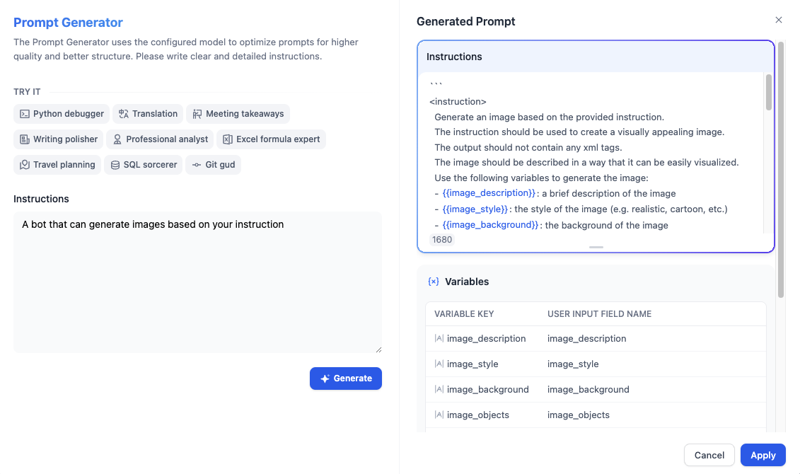

با این حال، برای درک بهتر پروم‌پت‌ها، نباید در مراحل اولیه به این ویژگی تکیه کنیم.

## انتشار

روی دکمه‌ی انتشار در گوشه‌ی بالا سمت راست کلیک کنید، و بعد از انتشار، **اجرای برنامه** را انتخاب کنید تا یک صفحه‌ی وب برای یک عامل در حال اجرا به صورت آنلاین دریافت کنید.

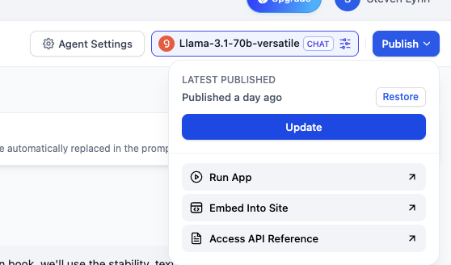

URL این صفحه‌ی وب را برای اشتراک گذاری با دوستان دیگر کپی کنید.

## سوال ۱: چطور می‌توان سبک تصاویر تولید شده را مشخص کرد؟

می‌توانیم دستورالعمل‌های سبک را در دستور ورودی کاربر اضافه کنیم، به عنوان مثال: سبک انیمه، یک دختر را بکشید که یک کتاب باز در دست دارد.

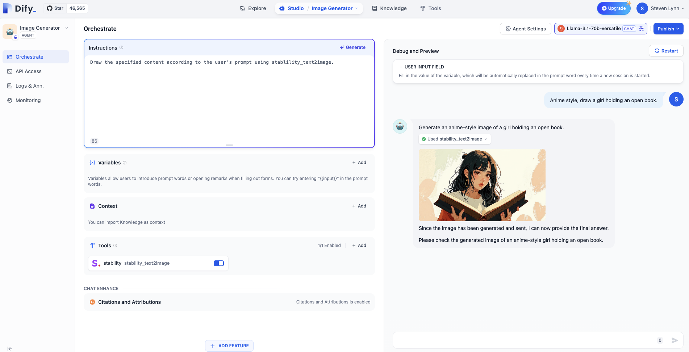

اما اگر می‌خواهیم سبک پیش فرض را به سبک انیمه تنظیم کنیم، می‌توانیم آن را به پروم‌پت سیستم اضافه کنیم زیرا قبلاً یاد گرفتیم که پروم‌پت سیستم هر بار که دستور کاربر اجرا می‌شود شناخته شده است و اولویت بالاتری دارد.

```
با استفاده از stability_text2image، محتوای مشخص شده را با توجه به پروم‌پت کاربر بکشید، تصویر به سبک انیمه است.
```

## سوال ۲: چطور می‌توان درخواست‌های خاص را از برخی کاربران رد کرد؟

در بسیاری از سناریوهای تجاری، باید از خروجی برخی محتواهای غیرمنطقی جلوگیری کنیم، اما LLM ها اغلب "احمق" هستند و بدون هیچ سؤالی از دستورالعمل‌های کاربر پیروی می‌کنند، حتی اگر محتوای خروجی اشتباه باشد. این پدیده که مدل با تلاش برای پاسخ دادن به کاربران با ساختن محتوای غلط، به اصطلاح **توهم مدل** نامیده می‌شود. بنابراین، لازم است که مدل در صورت لزوم درخواست‌های کاربر را رد کند.

علاوه بر این، ممکن است کاربران برخی از محتواها را که ارتباطی با تجارت ندارد، درخواست کنند و ما نیز باید عامل را وادار کنیم که چنین درخواست‌هایی را رد کند.

می‌توانیم از قالب markdown برای دسته‌بندی پروم‌پت‌های مختلف استفاده کنیم و پروم‌پت‌هایی که به عامل می‌آموزند که درخواست‌های غیرمنطقی را رد کند، را در عنوان "محدودیت‌ها" بنویسیم. البته، این قالب فقط برای استانداردسازی است و شما می‌توانید قالب خود را داشته باشید.

```
## وظیفه
با استفاده از stability_text2image، محتوای مشخص شده را با توجه به پروم‌پت کاربر بکشید، تصویر به سبک انیمه است.

## محدودیت‌ها
اگر کاربر محتوایی را درخواست کرد که مربوط به نقاشی نیست، پاسخ دهید: "متاسفم، نمی‌فهمم چه می‌گویی."
```

به عنوان مثال، بیایید بپرسیم: امشب شام چی داریم؟

&#x20;

<figure>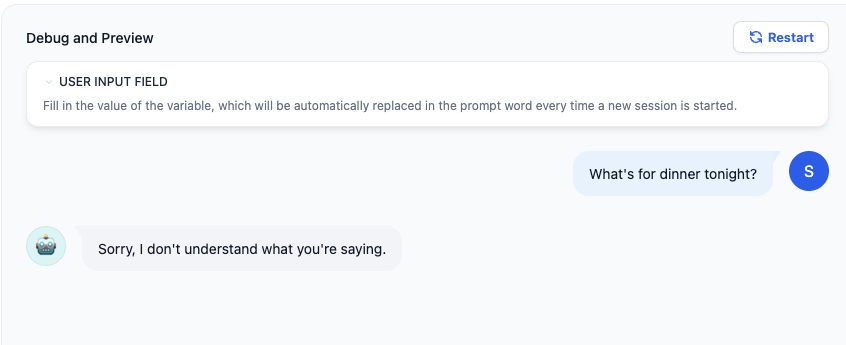<figcaption></figcaption></figure>

در برخی سناریوهای تجاری رسمی‌تر، می‌توانیم از یک کتابخانه‌ی کلمات حساس برای رد درخواست‌های کاربر استفاده کنیم.

کلمه‌ی کلیدی "شام" را در **افزودن ویژگی - تعدیل محتوا** اضافه کنید. وقتی کاربر کلمه‌ی کلیدی را وارد می‌کند، برنامه‌ی عامل "متاسفم، نمی‌فهمم چه می‌گویی" را خروجی می‌دهد.

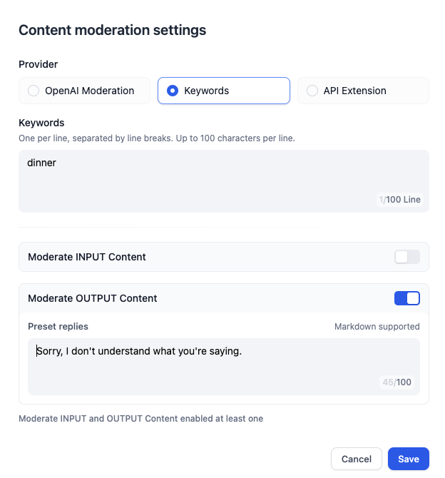


